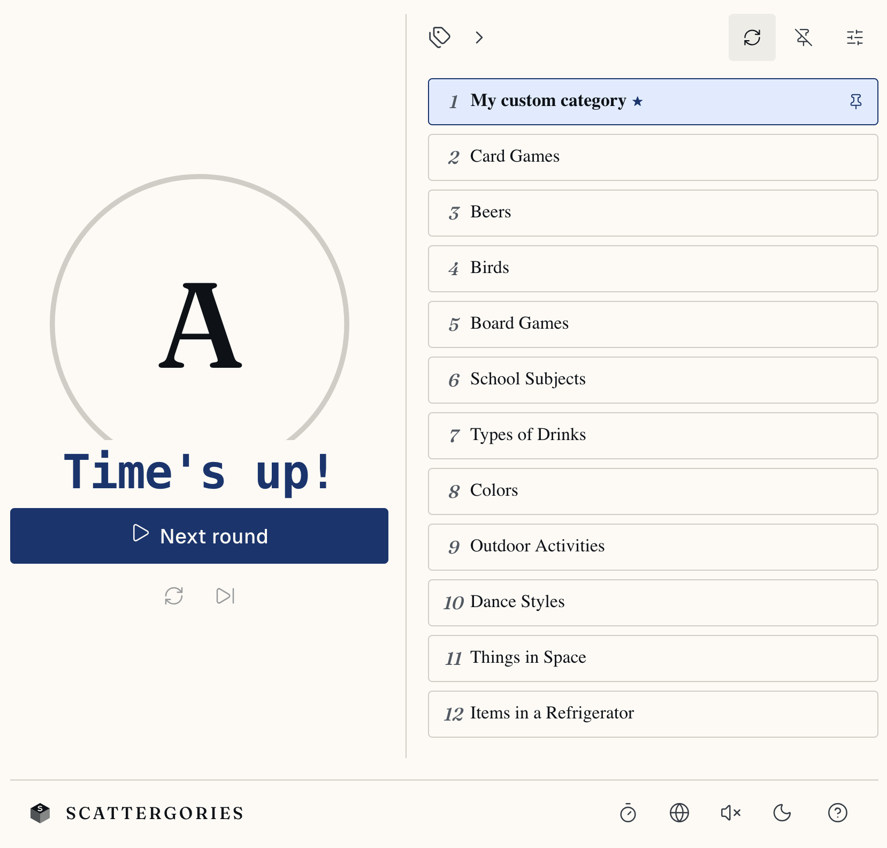

# Scattergories

[](https://github.com/simonvanlierde/scattergories/actions/workflows/ci.yml)
[](https://codecov.io/gh/simonvanlierde/scattergories)
[](LICENSE)
[](https://scattergories.duinlab.nl)
[](https://scattergories.duinlab.nl)

A browser-based companion for playing Scattergories at the table: no physical timer, die, or category cards needed. Single-page React app, no backend.

**Live demo:** [scattergories.duinlab.nl](https://scattergories.duinlab.nl)



## Features

- Rolls a letter with locale-aware weighting, so common, playable letters come up more often
- Draws a round of categories, with a built-in timer, pause, and end-of-round screen
- Redraw categories on each new letter, or pin a fixed board
- Built-in and custom category packs, persisted locally in the browser
- 9 fully-translated languages: English, Spanish, French, German, Italian, Dutch, Polish, Portuguese, Greek
- Installable as a PWA, with no account or server required

## Status

Feature-complete as a play aid. It runs fully client-side and stores everything in the browser; local-first by design, so there's no backend to host and your settings and custom categories never leave your device. It's a companion for in-person play, so it deliberately doesn't track scores or validate answers.

## Stack

React 19 · TypeScript · Vite · i18next · Vitest · Playwright · Biome

A separate Python (`uv` + Typer) tooling package in [`tools/`](tools/README.md) regenerates the locale assets (letter-frequency weights and translations) that the app ships.

## Getting started

Tool versions are pinned in [`mise.toml`](mise.toml) (Node 24.13.0, pnpm 10.33.2, Python 3.14). With [mise](https://mise.jdx.dev) installed:

```bash
mise install     # provisions the pinned Node, pnpm, and Python
pnpm install
pnpm dev          # http://localhost:5173
pnpm build        # static build to dist/
```

Without mise, install Node 24+ and pnpm 10+ yourself, then run the same `pnpm` commands.

Deploy `dist/` to any static host with an SPA fallback to `index.html`.

## Quality

Every dependency is locked and every tool version pinned, so a clean checkout builds identically.
One gate — `pnpm verify` — runs the same way locally, in pre-push hooks, and in CI. The core game logic holds 95%+ coverage, the production bundle is capped at an 80 KiB gzip budget, and axe-core accessibility scans run against the live app in CI.

See [`docs/quality.md`](docs/quality.md) for the full gate breakdown, coverage and budget details, and the accessibility checks.

## Project structure

For the layer diagram, round state machine, and data flow, see [`docs/architecture.md`](docs/architecture.md). The top-level map:

- [`src/`](src/) — the React app: `domain/game/` (pure game logic), `features/` (round, categories,
  settings), `app/` (shell and controller hooks), `i18n/` (locales and registry)
- [`tools/`](tools/README.md) — Python CLI (`sg-tools`) that regenerates the locale assets
- [`tests/`](tests/) — Playwright end-to-end specs
- [`docs/`](docs/) — [architecture](docs/architecture.md) and [decision records](docs/adr/)

Contributing? See [`CONTRIBUTING.md`](CONTRIBUTING.md) for the dev loop, conventions, and product scope.

## License

[MIT](LICENSE) © Simon van Lierde
