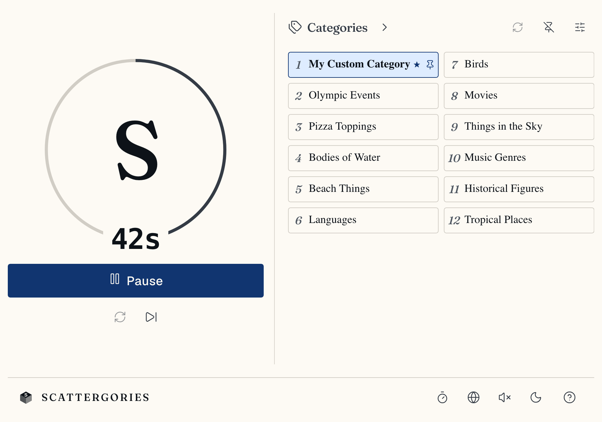

# Scattergories

[](https://github.com/simonvanlierde/scattergories/actions/workflows/ci.yml)
[](https://codecov.io/gh/simonvanlierde/scattergories)
[](LICENSE)
[](https://scattergories.duinlab.nl)
[](https://scattergories.duinlab.nl)

A browser-based companion for playing Scattergories at the table: no physical timer, die, or category cards needed. Single-page React app, no backend.

**Live demo:** [scattergories.duinlab.nl](https://scattergories.duinlab.nl)

<picture><source media="(prefers-color-scheme: dark)" srcset="docs/screenshots/desktop-dark.png"></picture>

## Features

Roll a letter, draw a board of categories, and race the timer to name one thing per category; the app handles the die, the cards, and the clock.

- Rolls a letter from each language's own alphabet, weighted by that language's letter frequencies, so common, playable letters come up more often
- 9 fully-translated languages: English, Spanish, French, German, Italian, Dutch, Polish, Portuguese, Greek
- Draws a round of categories, with a built-in timer, pause, and end-of-round screen
- Redraw categories on each new letter, or pin a fixed board
- Built-in and custom category packs, persisted locally in the browser
- Installable as a PWA, with no account or server required

## Architecture

**Stack**: React 19 · TypeScript · Vite · i18next · Vitest · Playwright · Biome. A separate Python (`uv` + Typer) package regenerates the locale assets.

### Project structure

For the layer diagram, round state machine, and data flow, see [`docs/architecture.md`](docs/architecture.md). The top-level map:

- [`src/`](src/): the React app: `domain/game/` (pure game logic), `features/` (round, categories,
  settings), `app/` (shell and controller hooks), `i18n/` (locales and registry)
- [`tools/`](tools/README.md): Python CLI (`sg-tools`) that regenerates the locale assets: per-language alphabets, letter-frequency weights, and translations
- [`tests/`](tests/): Playwright end-to-end specs
- [`docs/`](docs/): [architecture](docs/architecture.md) and [decision records](docs/adr/)

## Self hosting

Want your own instance? Install [Node and pnpm](https://nodejs.org/en/download), then:

```bash
pnpm install
pnpm dev          # http://localhost:5173
pnpm build        # static build to dist/
```

Node is pinned in [`.node-version`](.node-version) and pnpm in the `packageManager` field of [`package.json`](package.json); Corepack applies both automatically.

Deploy `dist/` to any static host with an SPA fallback to `index.html`.

### Deployment

Cloudflare Pages builds and publishes on every push to `main`. Build and preview settings live in the Cloudflare dashboard; the repo only pins the output directory in [`wrangler.jsonc`](wrangler.jsonc).

To deploy from a local checkout: `pnpm deploy` (`wrangler pages deploy`).

### Quality

A single `pnpm verify` gate (typecheck, lint, tests, build, bundle budget) runs identically locally, in pre-push hooks, and in CI, so a clean checkout builds the same everywhere. See [`docs/quality.md`](docs/quality.md) for coverage thresholds, the bundle budget, and the accessibility checks.

## Contributing

See [`CONTRIBUTING.md`](CONTRIBUTING.md) for the dev loop, conventions, and product scope.

## License

[MIT](LICENSE) © Simon van Lierde
