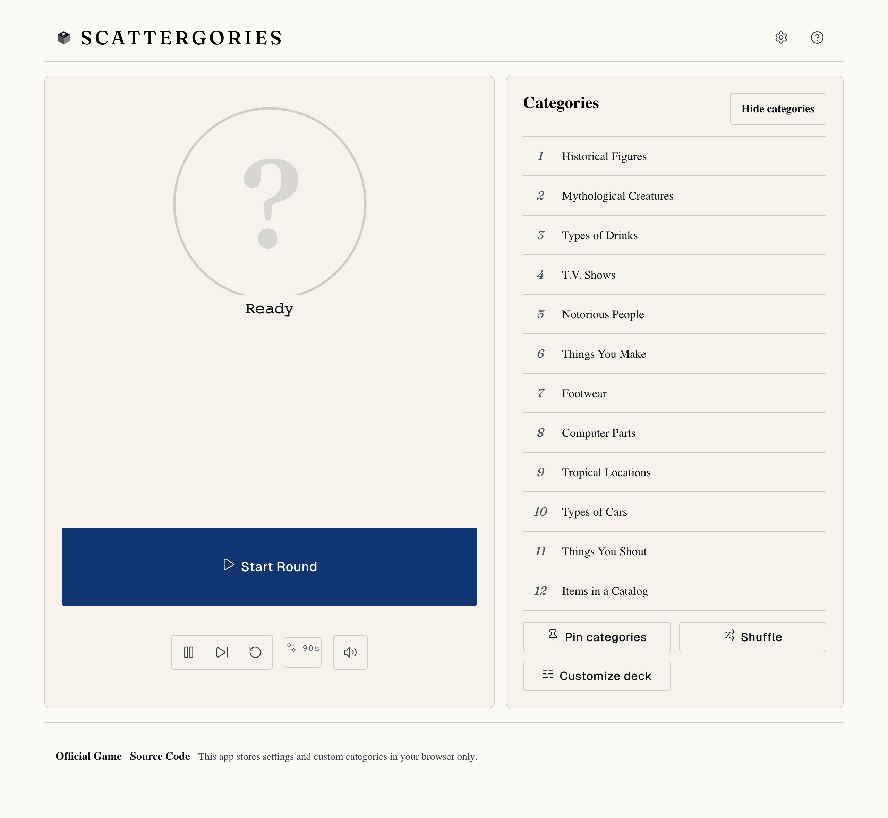
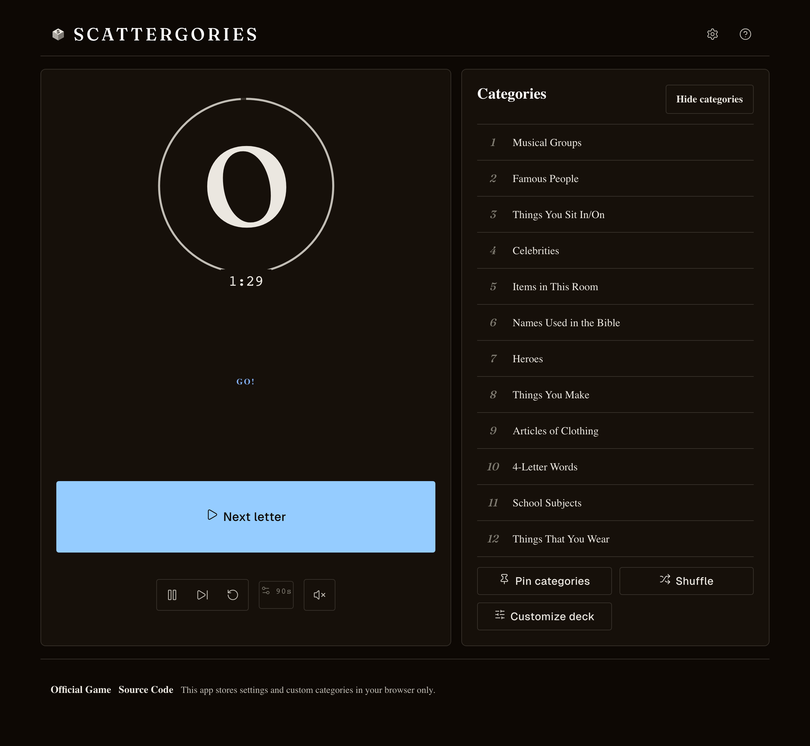
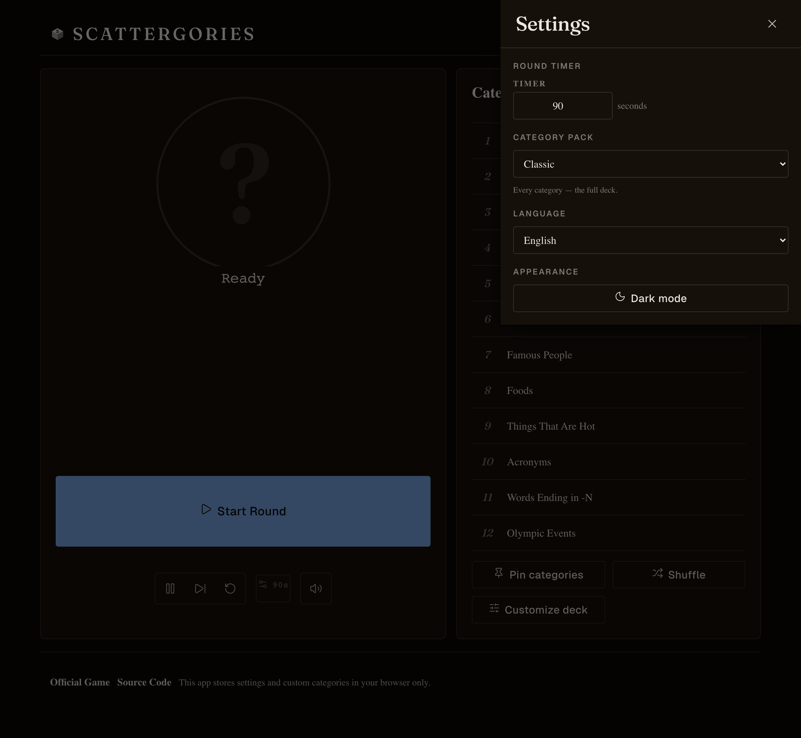

# Scattergories

[](https://github.com/simonvanlierde/scattergories/actions/workflows/ci.yml)
[](https://codecov.io/gh/simonvanlierde/scattergories)
[](LICENSE)

A browser-based companion for playing Scattergories at the table — no physical timer, die, or category cards needed. Single-page React app, no backend.



## Features

- Rolls a letter with locale-aware weighting, so common, playable letters come up more often
- Draws a round of categories, with a built-in timer, pause, and end-of-round screen
- Redraw categories on each new letter, or pin a fixed board
- Built-in and custom category packs, persisted locally in the browser
- 9 fully-translated languages: English, Spanish, French, German, Italian, Dutch, Polish, Portuguese, Greek
- Installable as a PWA — no account or server required

A round in progress (dark theme), and the settings panel:

| In a round | Settings |
| --- | --- |
|  |  |

## Status

Feature-complete as a play aid. It runs fully client-side and stores everything in the browser — local-first by design, so there's no backend to host and your settings and custom categories never leave your device. It's a companion for in-person play, so it deliberately doesn't track scores or validate answers.

## Stack

React 19 · TypeScript · Vite · i18next · Vitest · Playwright · Biome

A separate Python (`uv` + Typer) tooling package in [`tools/`](tools/README.md) regenerates the
locale assets (letter-frequency weights and translations) that the app ships.

## Getting started

Tool versions are pinned in [`mise.toml`](mise.toml) (Node 24.13.0, pnpm 10.33.2, Python 3.14). With [mise](https://mise.jdx.dev) installed:

```bash
mise install     # provisions the pinned Node, pnpm, and Python
pnpm install
pnpm dev          # http://localhost:5173
pnpm build        # static build to dist/
```

Without mise, install Node 24+ and pnpm 10+ yourself, then run the same `pnpm` commands.

Deploy `dist/` to any static host with an SPA fallback to `index.html`.

## Reproducibility & quality

Every dependency is locked (`pnpm-lock.yaml`, [`tools/uv.lock`](tools/uv.lock)) and every tool
version is pinned via [`mise.toml`](mise.toml), so a clean checkout builds identically. The same
gates run locally, in pre-push hooks ([`lefthook.yml`](lefthook.yml)), and in
[CI](.github/workflows/ci.yml):

```bash
pnpm check        # typecheck (tsc) + spellcheck (cspell) + lint (biome)
pnpm test         # unit / component tests (vitest)
pnpm test:e2e     # end-to-end tests (playwright)
pnpm verify       # check + test + build + bundle-size budget
pnpm ci           # verify, then the Python tools' ruff + ty + pytest
```

Quality is enforced, not just encouraged: the core game logic in `src/domain/game/` is held to
95%+ line and 100% function coverage (see [`vite.config.ts`](vite.config.ts)), and the production
bundle is capped at an 80 KiB gzip budget ([`scripts/check-bundle-budgets.mjs`](scripts/check-bundle-budgets.mjs)).

## Project layout

- [`src/`](src/) — the React app: `domain/game/` (pure game logic), `features/` (round, categories, settings), `app/` (shell and controller hooks), `i18n/` (locales and registry)
- [`tools/`](tools/README.md) — Python CLI (`sg-tools`) for inspecting and regenerating locale assets
- [`tests/`](tests/) — Playwright end-to-end specs
- [`AGENTS.md`](AGENTS.md) — architecture and contributor-facing design notes

## License

[MIT](LICENSE) © Simon van Lierde
