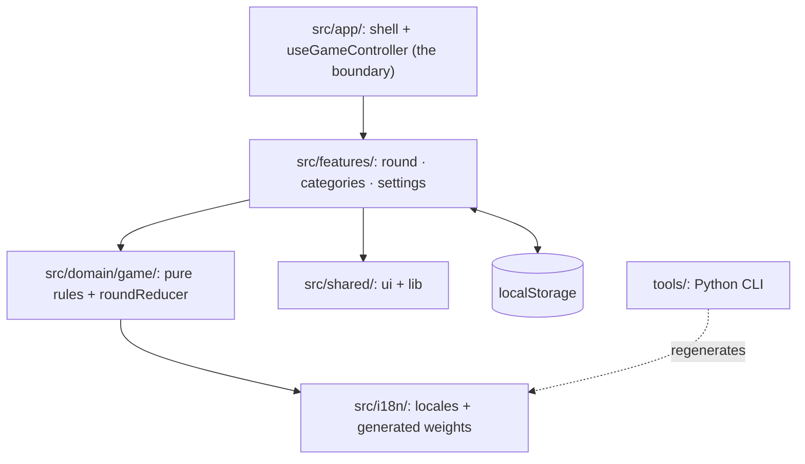
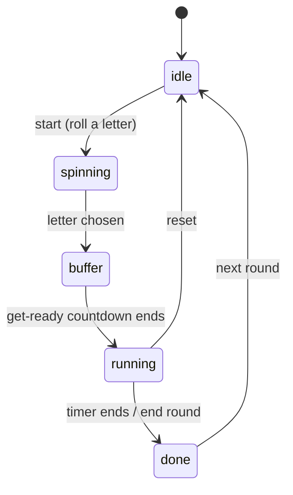

# Architecture

Scattergories is a single-page React app with no backend. Everything runs in the browser and persists to `localStorage`; the only build-time input from outside the app is the locale asset bundle regenerated by the Python `tools/` package.

## Layers

Source is layered so that the game rules never depend on React, and the UI never reaches past the `useGameController` boundary into feature internals.

## Round state machine

A round runs on a `useReducer` in [`roundReducer.ts`](../src/domain/game/roundReducer.ts). It is pure and framework-free, so its transitions are unit-tested directly without rendering anything:

## Data flow

`useGameController` composes the feature hooks and exposes a single typed surface to the shell. Round progress lives in the `roundReducer` state machine; letters are rolled with locale-aware weights drawn from `i18n/__generated__/letterWeights` (produced offline by `tools/`). Settings and custom category packs are the only persisted state, written through `localStorage`-backed hooks in `shared/lib`. There is no network call at runtime: closing the tab loses nothing that mattered, and nothing leaves the device.

## Design decisions

The reasoning behind the load-bearing choices lives in [`adr/`](adr/), starting with
[why there is no backend](adr/0001-local-first-no-backend.md).
